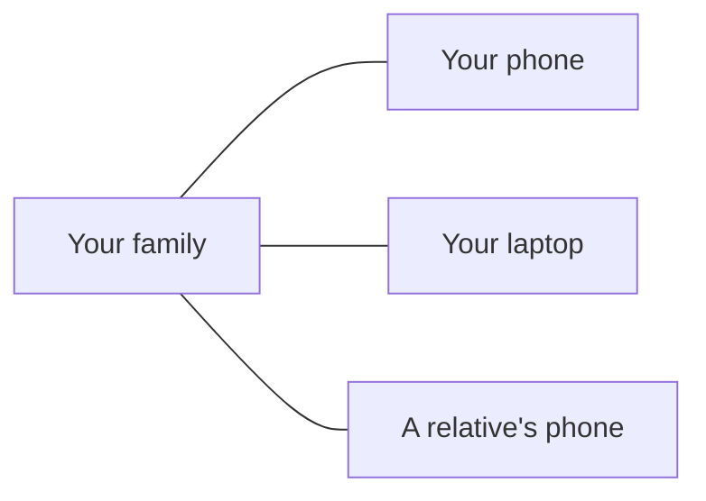
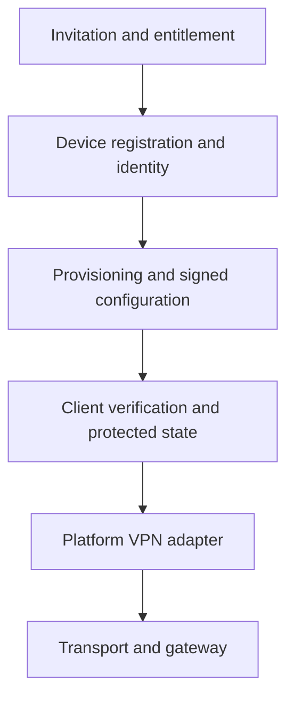

[Русская версия →](README.ru.md)

# Family Connect

**Private connectivity for families and devices across borders.**

Family Connect is a private networking project for families and personal devices, with an Android app for an encrypted connection and messaging. It started with a simple need: its developer lives in Europe, while people close to him live in Russia. The goal is to make staying connected easier, without asking family members to learn VPN configurations, servers or protocols.

**[Try the Android beta](docs/getting-started.en.md)** · [Getting started](docs/getting-started.en.md) · [How it works](#how-it-works) · [Security](SECURITY.md) · [Architecture](docs/architecture.md)

## Current release

Android **0.1.18-beta50** is available for existing users: voice messages, hold-to-record,
swipe-up locking, text edits and background notifications. New messages scroll into view. Switches are orange when off and turquoise when on.
[Install or update](docs/getting-started.en.md) · [Versions and checksums](docs/releases.md).

The invitation page provides Android beta50 and Linux0.2.10 / Windows0.2.11 previews. Install
the client, return to the original invitation mark **Application installed** and choose **Open application**.
[Desktop installation](docs/clients.en.md) · [Rollout checks](docs/releases/2026-09-23-windows0211-dpi.ru.md).

## Platforms

| Platform | Current availability |
| --- | --- |
| Android 8+ | Beta50; ARM64 APK, 36.4 MB. VPN, text and voice tested on phones; invitation-link activation. |
| Linux | GTK 4 / libadwaita desktop pilot; 0.2.10 preview8e9fabe3cbef2989. Operator-assisted setup. |
| Windows x64 | Native desktop pilot; 0.2.11 preview8906d62 installer. Invitation-link activation; no trusted publisher signature yet. |
| macOS / iOS | No application release. Apple-platform work remains on the longer-term roadmap. |

Invitation-link activation is available on all three clients. Messenger functionality is verified on Android; desktop feature parity is not claimed.

## A look inside

Android beta38 test build, Russian interface, captured on 23 September 2026. Actual native UI rendered during device testing; VPN is off in this capture. Historical screenshot; the current update is beta50. [Image provenance](docs/assets/README.md).

The idea: make connections manageable for people and their devices. This illustration is not a claim of a shared family dashboard or a direct mesh between devices.

## Why Family Connect?

- **Simple for family members.** An invitation leads to the download and an Open application button. Activate once, choose a connection and connect. Removing setup friction is the goal; the pilot still needs an invitation and Android permissions.
- **Inspectable development.** Client and server code, test evidence and architecture can be inspected publicly. The project is intended to become an open-source private network; the repository-wide license decision is still pending.
- **Personal device identities.** Device credentials and activation belong to a device. Family members do not need to share a single configuration file.
- **More than one connection option.** The Android friends beta offers AWG and TCP transports and a choice of gateway region. Automatic selection and recovery have separate experimental implementations and are not a cross-platform reliability guarantee.

## Why I built it

I live in Europe, while people close to me live in Russia.

I built Family Connect because I wanted a connection my family could use without learning VPN clients, configuration files, servers or networking. I wanted to configure it once and know that the next connection would be straightforward.

That personal need grew into a project for families and personal devices spread across different countries. Making secure networking approachable remains the reason for building it.

## How it works

1. **Get an invitation** from a participant or the pilot operator.
2. **Install and activate** the app by returning to your original invitation link.
3. **Choose a region and connect.** The app connects your device to the selected gateway, which provides Internet access.
4. **Use the messenger** with contacts whose keys you have checked. Messaging is a separate feature; a VPN connection is not itself a chat session.

Participants can share a QR code or invitation link from Settings. The recipient downloads the app, returns to that same link and opens the app to activate access.

## Project status

Family Connect is under active development. Some platforms and features are experimental. **This is a pilot, not a production-ready service.**

Android VPN, two-phone text/voice exchange and screen-off notifications have been confirmed in the pilot. Background delivery uses the app’s own service, not FCM. Delivery latency during deep Doze, broader device coverage and offline/restart acceptance remain open. Animated smileys are present; their rough edges are a known visual issue.

Desktop releases and Android beta releases have separate versions and capabilities. No app-store release or independent security audit is claimed. [Current state](docs/STATUS.md) takes precedence over dated engineering reports. [Next work](docs/PLAN.md).

## Getting started

**Android:** follow the [installation and invitation guide](docs/getting-started.en.md). Existing users install the new APK over the old version; keep the app and its data. No new invitation is needed for an ordinary update.

**Linux and Windows:** use the [desktop pilot instructions](docs/clients.en.md) and [current preview downloads](docs/releases.md). Linux dependency and VPN-helper setup requires operator assistance.

**Building from source:** see [development](#development). CI artifacts are test builds, not interchangeable with the signed Android friends APK.

## Security & privacy

Public source helps inspection; it does not establish security on its own. Device key storage, signed configuration verification and release checks are documented with their limits.

- [Security boundaries and reporting status](SECURITY.md)
- [Privacy: local data, gateways and metadata](docs/privacy.md)
- [Desktop update verification and signing](docs/updates.en.md)
- [Android beta artifact and checksum](docs/releases/2026-09-23-switch-colors-beta50.ru.md)

A VPN gateway is a trusted part of the connection and can observe destination metadata. Family Connect makes no anonymity or zero-logging guarantee.

## Architecture

This is the implemented provisioning path at a high level; integration maturity differs by platform. The networking code includes WireGuard, AmneziaWG and VLESS REALITY adapters. Reticulum carries control messages in the newer control path. The Rust QUIC relay lab is a separate experiment, not the Android VPN data path.

[Architecture map](docs/architecture.md) · [Device identity](docs/adr/001-identity-provisioning.en.md) · [Provisioning](docs/provisioning-provider.en.md) · [Messenger core](messenger/README.ru.md)

## Development

**Source snapshot:** this checkpoint includes Android beta50 and Linux0.2.10 / Windows0.2.11 previews. See [source acceptance](docs/releases/2026-09-23-switch-colors-beta50.ru.md) for checks and limits. CI uses test signing; byte-for-byte reproduction of the published APK is not claimed. Desktop preview is distributed as a manual preview; automatic catalogs remain separate.

Start with [CONTRIBUTING.md](CONTRIBUTING.md) for setup and scoped checks.

| Area | Source |
| --- | --- |
| Android client | [clients/android](clients/android/) |
| Linux client | [clients/desktop](clients/desktop/) |
| Windows client | [clients/windows](clients/windows/) |
| Registration and provisioning | [control](control/), [device_identity](device_identity/), [provisioning](provisioning/) |
| Messaging | [messenger](messenger/) |
| Experimental relay core | [core](core/) |

## Documentation

The [documentation map](docs/README.md) separates user guides, operator runbooks, development references and project history. Detailed engineering reports remain available.

## Contributing

Bug reports, clearer documentation and scoped patches are welcome. Include the platform and exact version, and remove private data from reports. See [contribution guidance](CONTRIBUTING.md); security-sensitive reports follow [SECURITY.md](SECURITY.md).

## License

A repository-wide license has not yet been selected. Public source availability alone does not grant reuse rights. Third-party components retain their own terms; the classic smiley asset provenance records unresolved redistribution terms. See the [licensing audit](docs/licensing.md) before reuse or redistribution.
