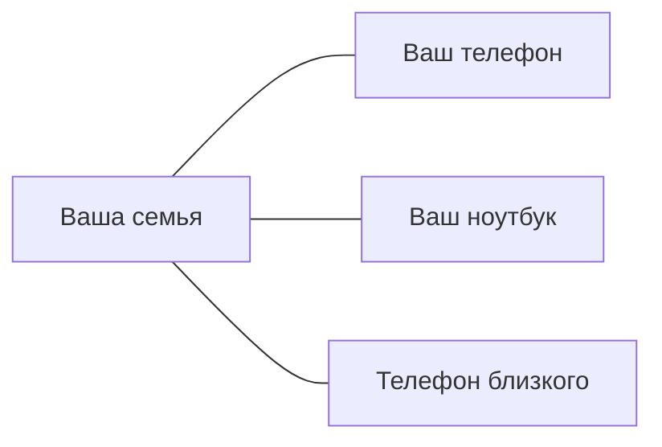
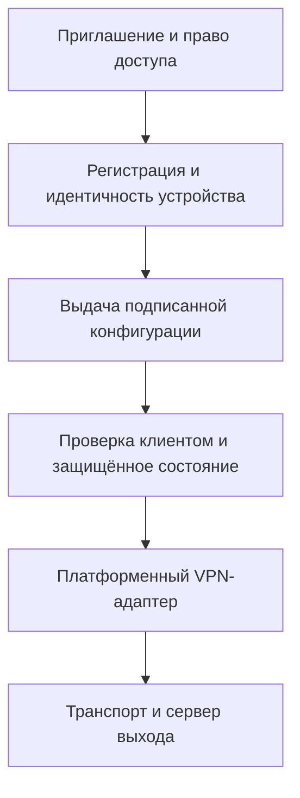

[English →](README.md)

**Новый приоритет этапа5:** Android → Telemost VP8 → Linux EU Gateway → Internet.
Reticulum control/recovery сохраняется, Windows Home Gateway — вторичная функция.
Пока подготовка: Family carrier/auth/TCP/DNS/full-device ещё не реализованы и не
проверены. [План и WEBRTC-EU gates](docs/PLAN.md). Home Gateway ниже — сохранённая
будущая функция, не prerequisite для решения мобильных белых списков.

Подготовка WebRTC underlay: Reticulum frames могут передаваться через изолированный
WB/Telemost/VK carrier наряду с direct paths. Первым теперь Telemost: пользователь подтвердил25.09 видеозвонок
Краснодар→Бельгия по сотовой сети при недоступном Family VPN. Headless/binary/RNS
carrier ещё не проверен; код и device tests отложены. [Обновлённый этап5](docs/PLAN.md).

## Personal/Home Gateway — активная разработка

Stage5: соединение Android↔домашний Windows в мобильной сети с белыми списками.
Reticulum — discovery и согласование; IP-трафик — через подходящий защищённый
транспорт напрямую или через relay, далее Internet либо существующий Family Connect VPN. Стабильная Device
Identity, без per-user DDNS и переноса ключей. Пока зафиксированы требования:
транспорт не реализован, реальная приёмка Android↔Windows RNS-2 впереди.
[Дизайн и milestones](docs/reticulum/HOME_GATEWAY_DESIGN.md) · [План](docs/PLAN.md).

# Family Connect

**Личная сеть для семей и устройств по разные стороны границ.**

Family Connect — проект частной сети для семьи и личных устройств, с Android-приложением для шифрованного подключения и переписки. Автор живёт в Европе, а его близкие — в России. Проект появился, чтобы им было проще оставаться на связи без изучения конфигураций VPN, серверов и протоколов.

**[Попробовать Android beta](docs/getting-started.ru.md)** · [Начало работы](docs/getting-started.ru.md) · [Как это работает](#как-это-работает) · [Безопасность](SECURITY.md) · [Архитектура](docs/architecture.md)

## Текущий выпуск

Android **0.1.18-beta50** доступен для обновления: голосовые, запись удержанием,
фиксация свайпом вверх, правки текста и фоновые уведомления. Новые сообщения
автоматически показываются в чате. Переключатели: оранжевые OFF, бирюзовые ON. [Установка и обновление](docs/getting-started.ru.md)
· [Версии и контрольные суммы](docs/releases.md).

На странице приглашения доступны Android beta50 и Linux0.2.10 / Windows0.2.14 preview.
Установите приложение, вернитесь к исходной ссылке, отметьте **Приложение установлено** и нажмите **Открыть приложение**.
[Установка desktop](docs/clients.ru.md) · [Проверки выпуска](docs/releases/2026-09-24-windows0214-installer.ru.md).

Windows0.2.14 исправляет повторную установку после сбоя и совместимость CET со старыми обновлениями Windows10. Целевые системы: Windows10 1809+ /11 x64; проверка на проблемном ПК ещё ожидается. С0.2.13 доступна кнопка «Проверить обновления», с0.2.12 и старше нужна одна ручная установка.

## Платформы

| Платформа | Что доступно сейчас |
| --- | --- |
| Android 8+ | Beta50; ARM64 APK, 36,4 МБ. VPN, текст и голосовые проверены; активация по ссылке приглашения. |
| Linux | Пилотный клиент GTK 4 / libadwaita; архив 0.2.10 preview8e9fabe3cbef2989. Настройка с помощью оператора. |
| Windows x64 | Нативный пилотный клиент; установщик 0.2.14 source6eed30c. Активация по ссылке; доверенной подписи издателя пока нет. |
| macOS / iOS | Выпущенных приложений нет. Работа над платформами Apple остаётся в долгосрочном плане. |

Вход по ссылке приглашения доступен на трёх платформах. Мессенджер проверен на Android; равенство его возможностей на desktop не заявляется.

## Как выглядит приложение

Тестовая Android beta38, русский интерфейс, 23 сентября 2026 года. Настоящий нативный экран с устройства; на кадре VPN выключен. Исторический снимок; актуальное обновление — beta50. [Происхождение изображения](docs/assets/README.md).

Идея проекта — сделать подключения понятными для людей и их устройств. Схема не означает, что уже реализованы общий семейный кабинет или прямая mesh-сеть между устройствами.

## Зачем Family Connect?

- **Проще для близких.** Приглашение ведёт к загрузке и кнопке открытия приложения. После активации можно выбрать подключение и включить его. Уменьшать сложность настройки — наша цель; в пилоте ещё нужны приглашение и разрешения Android.
- **Разработку можно изучить.** Исходники клиента и сервера, результаты проверок и архитектура публичны. Family Connect — проприетарный source-available проект; публичность не предоставляет прав на повторное использование.
- **У каждого устройства свои ключи.** Активация и учётные данные привязаны к устройству. Близким не нужно пользоваться одним общим конфигурационным файлом.
- **Несколько вариантов подключения.** Android beta предлагает AWG, TCP и выбор региона сервера. Автоматический выбор и восстановление имеют отдельные экспериментальные реализации; это ещё не гарантия надёжности на всех платформах.

## Почему я это сделал

Я живу в Европе, а мои близкие — в России.

Мне хотелось, чтобы они могли пользоваться соединением, не разбираясь в VPN-клиентах, конфигурационных файлах, серверах и сетях. Настроить один раз и знать, что следующее подключение не потребует сложных объяснений.

Из этой личной потребности вырос проект для семей и устройств, находящихся в разных странах. Сделать защищённое подключение понятным обычному человеку — причина, по которой я продолжаю его развивать.

## Как это работает

1. **Получите приглашение** от участника или оператора пилота.
2. **Установите и активируйте** приложение через исходную ссылку приглашения.
3. **Выберите регион и подключитесь.** Приложение соединит устройство с выбранным сервером, через который предоставляется выход в интернет.
4. **Пользуйтесь мессенджером** с контактами, чьи ключи вы проверили. Переписка — отдельная функция: само VPN-подключение не создаёт сеанс чата.

Участник может показать QR-код или отправить ссылку из настроек. Получатель устанавливает приложение, возвращается к исходной ссылке и открывает приложение для активации.

## Состояние проекта

Family Connect активно разрабатывается. Некоторые платформы и функции экспериментальны. **Это пилот, а не готовый к промышленной эксплуатации сервис.**

В пилоте подтверждены Android VPN, текст и голосовые между двумя телефонами, уведомления с выключенным экраном. Фоновая доставка использует собственную службу, без FCM. Задержка в глубоком Doze, широкая проверка устройств и приёмка offline/restart остаются открытыми. Анимированные смайлики работают, но неровные края остаются известным визуальным недостатком.

У настольных релизов и Android beta разные версии и возможности. Публикация в магазинах приложений и независимый аудит безопасности не заявляются. [Текущий статус](docs/STATUS.md) важнее датированных инженерных отчётов. [Следующие шаги](docs/PLAN.md).

## Начало работы

**Android:** [инструкция по установке и приглашению](docs/getting-started.ru.md). Для обновления установите новую APK поверх прежней версии, сохранив приложение и данные. Новое приглашение при обычном обновлении не требуется.

**Linux и Windows:** [инструкции настольного пилота](docs/clients.ru.md) и [актуальные preview](docs/releases.md). Установка зависимостей и VPN-компонентов Linux требует помощи оператора.

**Сборка из исходников:** см. [разработку](#разработка). Артефакты CI — тестовые сборки; они не взаимозаменяемы с подписанной APK для друзей.

## Безопасность и приватность

Публичные исходники помогают изучить приложение, но сами по себе не доказывают его безопасность. Хранение ключей, проверка подписанных конфигураций и проверка выпусков описаны вместе с ограничениями.

- [Границы защиты и состояние канала сообщения об уязвимостях](SECURITY.md)
- [Приватность: локальные данные, серверы и метаданные](docs/privacy.md)
- [Проверка и подпись настольных обновлений](docs/updates.ru.md)
- [Android beta и контрольная сумма](docs/releases/2026-09-23-switch-colors-beta50.ru.md)

VPN-сервер — доверенная часть соединения; ему доступны метаданные назначения трафика. Family Connect не обещает анонимность или полное отсутствие технических журналов.

## Архитектура

Это общая схема реализованной выдачи конфигурации; зрелость интеграции различается между платформами. Сетевой код включает адаптеры WireGuard, AmneziaWG и VLESS REALITY. Новый канал управления доставляет сообщения через Reticulum. Rust-стенд QUIC relay — отдельный эксперимент, а не путь VPN-трафика Android.

[Карта архитектуры](docs/architecture.md) · [Идентичность устройства](docs/adr/001-identity-provisioning.ru.md) · [Provisioning](docs/provisioning-provider.ru.md) · [Ядро мессенджера](messenger/README.ru.md)

## Разработка

**Состояние исходников:** этот checkpoint включает Android beta50 и Linux0.2.10 / Windows0.2.14 preview. Проверки и ограничения описаны в [отчёте](docs/releases/2026-09-23-switch-colors-beta50.ru.md). CI использует тестовую подпись; побайтовая воспроизводимость опубликованной APK не заявляется. Linux остаётся manual preview. Windows0.2.14 использует отдельный подписанный каталог после одной ручной установки переходной версии.

Начните с [CONTRIBUTING.md](CONTRIBUTING.md): настройка окружения и проверки по компонентам.

| Компонент | Исходники |
| --- | --- |
| Android | [clients/android](clients/android/) |
| Linux | [clients/desktop](clients/desktop/) |
| Windows | [clients/windows](clients/windows/) |
| Регистрация и конфигурации | [control](control/), [device_identity](device_identity/), [provisioning](provisioning/) |
| Переписка | [messenger](messenger/) |
| Экспериментальное relay-ядро | [core](core/) |

## Документация

[Карта документации](docs/README.md) разделяет пользовательские инструкции, эксплуатацию, разработку и историю проекта. Подробные инженерные отчёты сохранены.

## Участие в проекте

Полезны сообщения об ошибках, улучшения документации и небольшие предметные изменения. Указывайте платформу и точную версию; удаляйте личные данные из отчётов. См. [инструкцию участника](CONTRIBUTING.md); для уязвимостей — [SECURITY.md](SECURITY.md).

## License / Лицензия

Family Connect — проприетарное ПО с публично доступными исходниками (source-available).
Публичный репозиторий не делает Family Connect open source. Все права сохранены,
кроме явно установленных условий сторонних компонентов. См. [LICENSE](LICENSE),
[Third-Party Notices](THIRD_PARTY_NOTICES.md) и [аудит](docs/legal/DEPENDENCY_LICENSE_AUDIT.md).
Публичность не разрешает использование кода в другом продукте, распространение
производных, продажу копий, перепубликацию существенных частей или использование
бренда. Права третьих лиц и ранее выданные разрешения сохраняются. Права на
распространение классических смайликов остаются неустановленными.

Family Connect is source-available proprietary software. The source repository
being public does not make Family Connect open source. All rights are reserved
except where explicitly stated for third-party components. See [LICENSE](LICENSE),
[Third-Party Notices](THIRD_PARTY_NOTICES.md) and the [license audit](docs/legal/DEPENDENCY_LICENSE_AUDIT.md).
Public visibility grants no general reuse, derivative distribution, resale,
substantial republication or branding permission. Existing third-party rights and
prior valid grants are preserved. Classic smiley redistribution rights remain unresolved.
