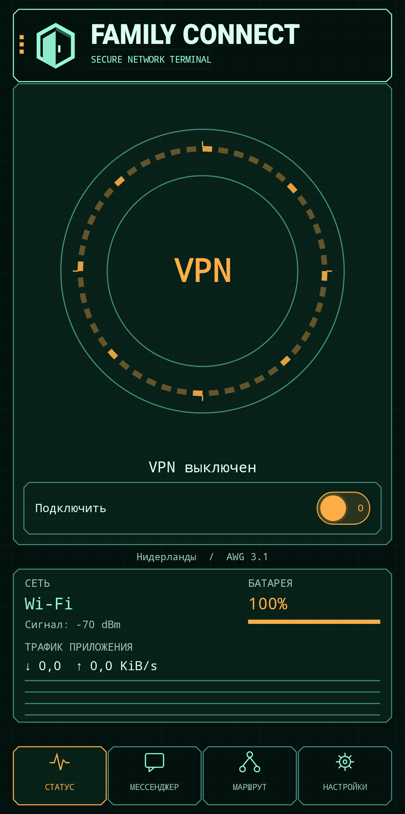
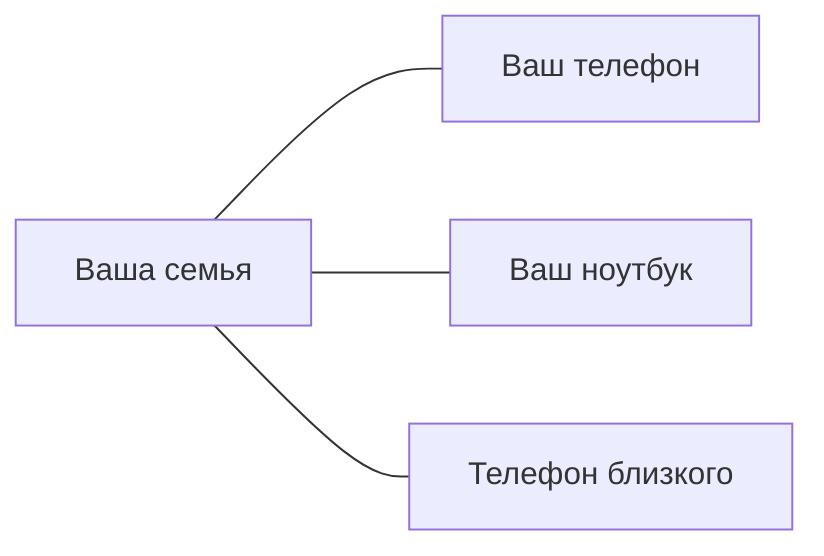
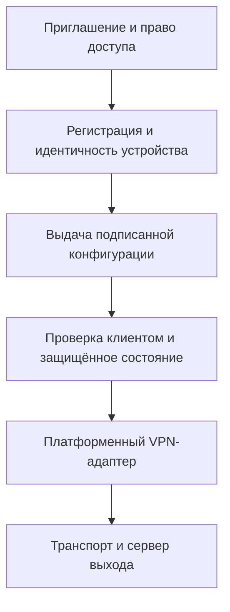

[English →](README.md)

# Family Connect

**Личная сеть для семей и устройств по разные стороны границ.**

Family Connect — проект частной сети для семьи и личных устройств, с Android-приложением для шифрованного подключения и переписки. Автор живёт в Европе, а его близкие — в России. Проект появился, чтобы им было проще оставаться на связи без изучения конфигураций VPN, серверов и протоколов.

**[Попробовать Android beta](docs/getting-started.ru.md)** · [Начало работы](docs/getting-started.ru.md) · [Как это работает](#как-это-работает) · [Безопасность](SECURITY.md) · [Архитектура](docs/architecture.md)

## Платформы

| Платформа | Что доступно сейчас |
| --- | --- |
| Android 8+ | Beta19 по приглашению; ARM64 APK, 36,4 МБ. VPN и текстовая переписка проверены на телефонах. |
| Linux | Пилотный клиент GTK 4 / libadwaita; архив v0.2.9. Настройка с помощью оператора. |
| Windows x64 | Нативный пилотный клиент; установщик v0.2.9. Активация через оператора; доверенной подписи издателя пока нет. |
| macOS / iOS | Выпущенных приложений нет. Работа над платформами Apple остаётся в долгосрочном плане. |

Возможности и активация различаются. Нынешние приглашения для друзей и мессенджер доступны в Android beta, а не в опубликованных настольных версиях.

## Как выглядит приложение

Android beta19, русский интерфейс. Настоящий нативный экран, отрисованный при тестировании на устройстве; на этом кадре VPN выключен. [Происхождение изображения](docs/assets/README.md).

Идея проекта — сделать подключения понятными для людей и их устройств. Схема не означает, что уже реализованы общий семейный кабинет или прямая mesh-сеть между устройствами.

## Зачем Family Connect?

- **Проще для близких.** В Android приглашение ведёт к APK и коду активации. После активации можно выбрать подключение и включить его. Уменьшать сложность настройки — наша цель; в пилоте ещё нужны приглашение и разрешения Android.
- **Разработку можно изучить.** Исходники клиента и сервера, результаты проверок и архитектура публичны. Проект задуман как открытая частная сеть; общая лицензия репозитория пока не выбрана.
- **У каждого устройства свои ключи.** Активация и учётные данные привязаны к устройству. Близким не нужно пользоваться одним общим конфигурационным файлом.
- **Несколько вариантов подключения.** Android beta предлагает AWG, TCP и выбор региона сервера. Автоматический выбор и восстановление имеют отдельные экспериментальные реализации; это ещё не гарантия надёжности на всех платформах.

## Почему я это сделал

Я живу в Европе, а мои близкие — в России.

Мне хотелось, чтобы они могли пользоваться соединением, не разбираясь в VPN-клиентах, конфигурационных файлах, серверах и сетях. Настроить один раз и знать, что следующее подключение не потребует сложных объяснений.

Из этой личной потребности вырос проект для семей и устройств, находящихся в разных странах. Сделать защищённое подключение понятным обычному человеку — причина, по которой я продолжаю его развивать.

## Как это работает

1. **Получите приглашение** от участника или оператора пилота.
2. **Установите и активируйте** Android-приложение своим кодом.
3. **Выберите регион и подключитесь.** Приложение соединит устройство с выбранным сервером, через который предоставляется выход в интернет.
4. **Пользуйтесь мессенджером** с контактами, чьи ключи вы проверили. Переписка — отдельная функция: само VPN-подключение не создаёт сеанс чата.

Участник может показать QR-код или отправить ссылку из настроек. Получатель скачивает APK и получает свой код на этой странице; код пока нужно вручную вставить в приложение.

## Состояние проекта

Family Connect активно разрабатывается. Некоторые платформы и функции экспериментальны. **Это пилот, а не готовый к промышленной эксплуатации сервис.**

В пилоте подтверждены подключение Android VPN и текстовая переписка между двумя телефонами. Входящие обновляются, пока мессенджер открыт; фоновые push-уведомления, широкая проверка устройств и приёмка offline/restart ещё не завершены. Анимированные смайлики работают, но неровные края остаются известным визуальным недостатком.

У настольных релизов и Android beta разные версии и возможности. Публикация в магазинах приложений и независимый аудит безопасности не заявляются. [Текущий статус](docs/STATUS.md) важнее датированных инженерных отчётов. [Следующие шаги](docs/PLAN.md).

## Начало работы

**Android:** [инструкция по установке и приглашению](docs/getting-started.ru.md). Для обновления установите новую APK поверх прежней версии, сохранив приложение и данные. Новое приглашение при обычном обновлении не требуется.

**Linux и Windows:** [инструкции настольного пилота](docs/clients.ru.md) и [релиз v0.2.9](https://github.com/Joker20380/family_connect/releases/tag/v0.2.9). Для активации сейчас нужна помощь оператора.

**Сборка из исходников:** см. [разработку](#разработка). Артефакты CI — тестовые сборки; они не взаимозаменяемы с подписанной APK для друзей.

## Безопасность и приватность

Публичные исходники помогают изучить приложение, но сами по себе не доказывают его безопасность. Хранение ключей, проверка подписанных конфигураций и проверка выпусков описаны вместе с ограничениями.

- [Границы защиты и состояние канала сообщения об уязвимостях](SECURITY.md)
- [Приватность: локальные данные, серверы и метаданные](docs/privacy.md)
- [Проверка и подпись настольных обновлений](docs/updates.ru.md)
- [Android beta и контрольная сумма](docs/releases/2026-09-19-beta19-download.ru.md)

VPN-сервер — доверенная часть соединения; ему доступны метаданные назначения трафика. Family Connect не обещает анонимность или полное отсутствие технических журналов.

## Архитектура

Это общая схема реализованной выдачи конфигурации; зрелость интеграции различается между платформами. Сетевой код включает адаптеры WireGuard, AmneziaWG и VLESS REALITY. Новый канал управления доставляет сообщения через Reticulum. Rust-стенд QUIC relay — отдельный эксперимент, а не путь VPN-трафика Android.

[Карта архитектуры](docs/architecture.md) · [Идентичность устройства](docs/adr/001-identity-provisioning.ru.md) · [Provisioning](docs/provisioning-provider.ru.md) · [Ядро мессенджера](messenger/README.ru.md)

## Разработка

**Состояние исходников:** публичная ветка main пока отстаёт от распространяемой Android beta19. Возможности выше относятся к проверенной APK; сборка main не воспроизводит эту версию. Публикация соответствующего состояния исходников включена в [план](docs/PLAN.md).

Начните с [CONTRIBUTING.md](CONTRIBUTING.md): настройка окружения и проверки по компонентам.

| Компонент | Исходники |
| --- | --- |
| Android | [clients/android](clients/android/) |
| Linux | [clients/desktop](clients/desktop/) |
| Windows | [clients/windows](clients/windows/) |
| Регистрация и конфигурации | [control](control/), [device_identity](device_identity/), [provisioning](provisioning/) |
| Переписка | [messenger](messenger/) |
| Экспериментальное relay-ядро | [core](core/) |

## Документация

[Карта документации](docs/README.md) разделяет пользовательские инструкции, эксплуатацию, разработку и историю проекта. Подробные инженерные отчёты сохранены.

## Участие в проекте

Полезны сообщения об ошибках, улучшения документации и небольшие предметные изменения. Указывайте платформу и точную версию; удаляйте личные данные из отчётов. См. [инструкцию участника](CONTRIBUTING.md); для уязвимостей — [SECURITY.md](SECURITY.md).

## Лицензия

Общая лицензия репозитория пока не выбрана. Публичная доступность исходников сама по себе не предоставляет права на повторное использование. У сторонних компонентов свои условия; в происхождении классических смайликов отмечены неустановленные условия распространения. Перед использованием и распространением ознакомьтесь с [лицензионным аудитом](docs/licensing.md).
