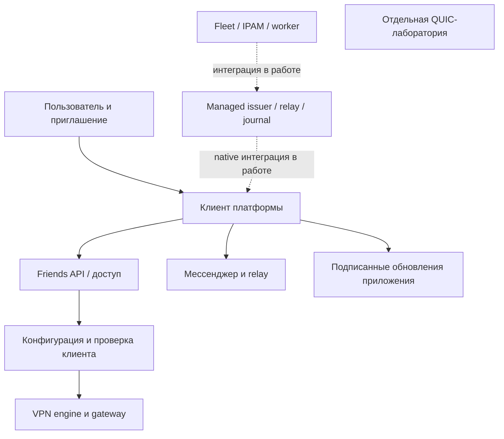

# Карта кода Family Connect

Срез локального checkout24.09.2026. Начальная точка для нового разработчика.
Карта описывает модули и связи, а не каждую строку. Факт установки/выпуска проверять
в [STATUS](../STATUS.md); очередность задач — в [PLAN](../PLAN.md).
Локальные исходники и документация могут опережать GitHub и установленные клиенты.

## С чего начать

1. Прочитать STATUS, PLAN и [правила разработки](../../CONTRIBUTING.md).
2. Выбрать контур в таблице ниже и прочитать его модульную страницу.
3. Проследить нужный сценарий от входа до хранилища/побочного эффекта и найти тест.
4. Проверить release report для нужной платформы: unit-тест не равен проверке VPN.
5. Перед изменением состояния прочитать runbook. Не запускать deploy/install/provision
   scripts как способ «познакомиться с проектом».

## Контуры системы

| Контур | Главные каталоги | Состояние и граница |
| --- | --- | --- |
| Friends: приглашение, устройство, VPN | control/friends, provisioning/friends*, clients | Пилот; оплата и полная коммерческая модель ещё не реализованы |
| Managed control и парк серверов | control/fleet*, provisioning, Control* в клиентах | Этап5, отдельные компоненты проверены; сквозная production интеграция не завершена |
| Product enrollment | control/product, control/migrations | Отдельный контур регистрации/выдачи; не считать его хранилище копией Friends или fleet |
| Мессенджер | messenger, Android Chat*, Python bridge | Есть Android-пилот; не переносить его готовность на desktop |
| Обновления приложений | updates, scripts/sign_update.py, клиентские updater | Отдельный подписанный канал, не VPN-конфигурация |
| Экспериментальная QUIC-сеть | core, control/app.py, data, distributed | Лаборатория, не текущий путь AWG/REALITY Friends |
| Эксплуатация и испытания | deploy, pilot, scripts, .github/workflows | Инструменты с разными побочными эффектами; запуск только по назначению |

Сплошные стрелки показывают логические взаимодействия пилотного пути, пунктирные —
незавершённую интеграцию. Diagram не является схемой сетевой маршрутизации/развёртывания.

## Модульные страницы

- [Сервер, идентичности, provisioning и fleet](backend.ru.md).
- [Android, Linux и Windows](clients.ru.md).
- [Мессенджер, уведомления и телеметрия](messaging.ru.md).
- [Развёртывание, сборки, тесты и QUIC-лаборатория](operations.ru.md).
- [Подробная карта managed control](../managed-control-code-map.ru.md): журнал,
  подпись, применение, смена gateway, rollback и открытые границы интеграции.

## Где менять поведение

| Задача | Начать здесь | Проверить рядом |
| --- | --- | --- |
| Активация приглашения | control/friends/access.py и клиентский Friends owner | Одноразовый proof, сохранность identity, revoke |
| Добавление сервера/IPAM | control/fleet.py, fleet_store.py | Пулы, capacity, generation, удаление peer до переиспользования IP |
| Выдача новой VPN-конфигурации | control/fleet_publish.py, provisioning/configuration.py | Signature/recipient/version, offline authority, lease и rollback |
| Переключение gateway на Android | ControlTransaction, ControlApplication, ConnectionService | Owner, durable selection, expiry/restart, отсутствие второго engine |
| UI Linux | clients/desktop/app.py, friends_ui.py | UI thread, backend arbiter, GTK rendering |
| Привилегии Windows | Broker.cs, Native.cs, Wire.cs | SID, происхождение pipe, сервис, DPAPI, native Windows tests |
| Текст/голос/доставка | messenger/chat.py, codec.py и Android Chat* | ACK после записи, лимиты, повторы, экран выключен/Doze |
| Новая версия приложения | scripts/sign_update.py и updater платформы | Immutable artifacts, последовательность, offline signer, public hashes |
| Показ нагрузки | deploy/server-load и клиентский ServerLoad | Свежесть измерения, ошибки сети, отсутствие персонального трафика |
| Платежи/Django | PLAN пункт7.1 | Пока план: не искать готовую платежную систему в control/product/admin.py |

## Хранилища и доверие

- Ключи устройства, ключ службы Reticulum, WG keys и offline signing key имеют разные
  роли. Нельзя подменить один другим или автоматически создать новые при ошибке чтения.
- Friends, ProductStore, fleet DB, gateway journal и клиентский journal — разные
  авторитетные состояния. Их нельзя синхронизировать копированием таблиц «на глаз».
- Номера схем независимы: wire schema, fleet DB и Android journal не имеют общего
  счётчика. Миграции и downgrade описывать для каждого отдельно.
- Private keys, реальные профили, сообщения и DB не являются fixtures. Не открывать
  и не помещать в отчёты содержимое локальных `state-*`, `artifacts` и резервных копий.
- Reticulum обеспечивает доставку только при существующем пути; crypto identity не
  создаёт связность. См. [recovery](../reticulum-recovery-design.ru.md).

## Как поддерживать карту

При новом модуле/переносе ответственности обновлять его строку, входы, хранилище,
инварианты и тесты на соответствующей странице. При новом формате обновлять границы
совместимости. При выпуске обновлять STATUS и release report, не переписывая историю.
Ссылки проверять `python3 scripts/check_public_docs.py --all` и `git diff --check`.
Не писать «опубликовано» без подтверждения remote commit/артефакта.
