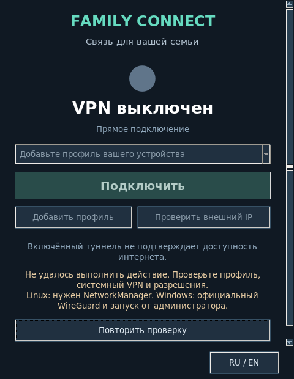

# Linux and Windows application layout

2026-09-10. Source fixes; installed user applications have not been replaced.

Linux clipping came from a fixed vertical pack layout without scrolling, fixed label
wrap widths and a two-button row regardless of text size. Windows used an implicit
TableLayoutPanel row distribution and unconstrained localized labels. Larger fonts
and errors could push actions out of view.

Linux now wraps labels to the viewport, stacks secondary actions when needed, uses a
smaller header, scrollable content and a separate language footer. Keyboard focus
scrolls actions into view; wheel scrolling is supported. The minimum width accounts
for actual button text/font size at HiDPI. Dark button/profile styles match the window,
disabled text remains legible, and the empty selector explains the next step. Closing
cancels the polling timer.

Windows now uses explicit AutoSize rows, bounded wrapping labels, a scrolling viewport
and a separate footer. Default client area is 480×620; minimum 360×420 scales with DPI.
PerMonitorV2 and resize/DPI recalculation are enabled. The device-code dialog uses a
responsive table, multiline code and a persistent copy button. Activation behavior and
primary actions remain the same.

Linux display tests passed 18 RU/EN × size × 100/150/200% font-scale combinations,
including long errors, horizontal bounds, full button widths and focused action
visibility. At high scale, the physical minimum width may exceed a requested 360px to
fit the enlarged text. Run `xvfb-run -a python3 clients/desktop/layout_check.py`.

The Windows .NET 10 cross-build passed with no warnings/errors. `/layout-test` covers
144 language/state/size/programmatic-scale combinations without broker calls and is
wired into Windows CI. **The WinForms runtime test was not run on this Linux host.**
It also does not replace manual Windows checks at real 100/150/200% display scaling,
moving between monitors, and opening the code dialog before installer release.
