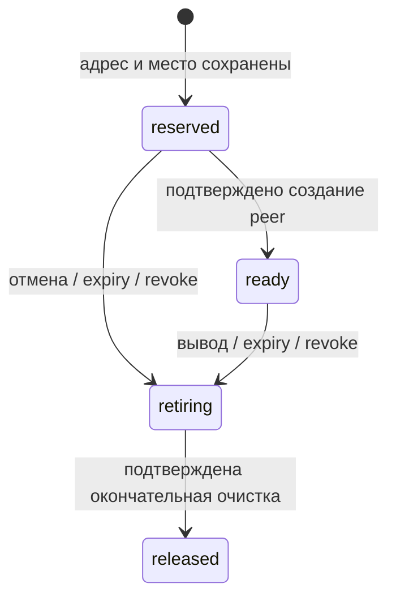

# Fleet: постоянный учёт IP-адресов и мест на шлюзах

Реализация от 24.09.2026: [`control/fleet_store.py`](../control/fleet_store.py).
Связанные документы: [контракт этапа5](stage5-fleet-contract.ru.md),
[отчёт о проверках](releases/2026-09-24-fleet-leases.ru.md).

## Граница готовности

Готова локальная серверная библиотека: постоянный реестр, public device binding,
версии доступа, атомарные адресные выдачи, состояния подготовки/удаления, история
идемпотентных запросов и обнаружение незавершённой работы после restart.
Она использует SQLite и POSIX file lock на одном управляющем хосте.

Библиотека не подключена к рабочим Friends/product DB и не выдаёт подписанные
конфигурации. Дополнительно реализованы [gateway adapter/fencing](fleet-wg-ssh.ru.md)
и [proof авторизация/scheduler](fleet-access-scheduler.ru.md). Схема2 содержит
challenges/jobs; есть claims для процессов одного хоста. Теперь схема3 содержит
также [offline publications](fleet-publication.ru.md), явная миграция1/2→3.
Это не распределённая HA-база. Перенос действующих прав и offline→online впереди.

## Хранение и инварианты

Явный `initialize(registry)` создаёт новый приватный каталог0700 и `fleet.db`0600.
Существующий, в том числе частично созданный каталог повторно не инициализируется.
Обычное открытие использует SQLite `mode=rw`: потерянный файл не создаётся заново.
Проверяются тип, владелец, permissions и hardlink count файла; symlink не разрешён.
На файле блокировки используется flock; база открывается с foreign keys,
`synchronous=FULL` и `BEGIN IMMEDIATE`. Транзакция включает все связанные изменения.
После инициализации выполняется fsync каталога.

| Таблица | Что сохраняется |
| --- | --- |
| `metadata` | Версия схемы3 и последнее время успешной операции |
| `registries` | Полные проверенные версии инвентаря; прежние снимки не удаляются |
| `access` | Device reference, public RNS identity, public WG key, revision/expiry/revoke и max_leases |
| `leases` | ID выдачи, gateway, страна/транспорт, внутренний `/32`, версии реестра/доступа, срок, состояние и generation |
| `requests` | `(device, request_id)` → fingerprint параметров и неизменный lease ID |
| `events` | Локальная история registry/access/reserved/ready/retiring/released; это не криптографически защищённый audit log |

Приватные device keys, профильные credentials и signing key не принимаются.
Сама DB содержит идентификаторы и адреса устройств, поэтому не публикуется,
не выводится целиком и не добавляется в Git. Восстановление старой полной копии DB
владельцем/root не обнаруживается внешним monotonic anchor: защита от такого rollback
не заявляется. Backup/restore вместе с удалёнными peers требует отдельной процедуры.

Уникальные partial indexes для всех `state != released`:

- `(gateway_id, address)` — один внутренний IP не принадлежит двум выдачам.
- `(device, gateway_id)` — один слот устройства на узле; совместное использование
  адреса разными транспортами пока не реализовано.
- `(device, country, transport, version)` — одна незавершённая выдача данного назначения.

Лимит gateway сейчас считается по leases, а не по людям или активным handshakes.
Все reserved/ready/retiring занимают место. Лимит устройства `max_leases` общий
для стран и транспортов, допустим1–8. Снижение лимита запрещает новые выдачи;
само по себе оно не удаляет действующие подключения.

## Атомарная выдача

`reserve()` получает device, постоянный request ID, ожидаемую registry revision,
страну, транспорт/версию, lifetime до86400 секунд и проверенные observations.

1. Под блокировкой начинается SQLite write transaction, проверяется время.
2. Доступ устройства должен существовать, не быть отозванным и не истечь.
3. Для повторного request ID сравнивается fingerprint страны/транспорта/версии/
   lifetime/семейств IP. Совпадение возвращает прежний lease, изменение — отказ.
4. Новый запрос требует текущую registry revision, отсутствие дубликата назначения
   и свободное место в общем лимите устройства.
5. Планировщик использует свежие observations и реальное число занятых мест в DB.
   Низкий stale count не может переопределить локальные reservations. Число мест
   берётся как max двух снимков **одной и той же популяции выдач**.
6. В пуле выбранного узла ищется свободный `/32`; адрес сети, первый host
   (зарезервирован шлюзу) и broadcast никогда не выдаются. Пулы уже проверены на
   отсутствие пересечений валидатором реестра.
7. Lease, request mapping и event записываются вместе. Expiry ограничен также
   сроком доступа. Возврат результата происходит после успешного commit.

DB должна быть единственным allocator. Перед подключением к существующим шлюзам
обязательны полный импорт/сверка прежних выдач и прекращение параллельной выдачи
из старого allocator. `max(local, observed)` не вычисляет объединение двух разных
наборов управляемых и неучтённых peers. Публичные dashboard-метрики и самостоятельная
выдача другим контроллером с этой гарантией несовместимы.

Повтор запроса не требует нового snapshot telemetry и не продлевает lease.
После изменения реестра он всё ещё возвращает исходную запись. После release
он возвращает историческое состояние released, а не создаёт новую выдачу.
Для новой выдачи нужен новый request ID; до подтверждённой очистки старой тот же
scope остаётся занят. При revoked/expired access даже повтор запрещён.

## Состояния и удалённые операции



Начальная generation1. Переход в retiring увеличивает её один раз; повторные retire
идемпотентны. `mark_ready()` принимает только текущую generation и действующую
reserved/ready выдачу с живым доступом. Ответ старого worker после revoke/retire
не возвращает выдачу в ready.

`expire()` только переводит истёкшие записи в retiring. Даже если подготовка peer
не была подтверждена, адрес остаётся занят: операция могла успеть на сервере, а её
ответ — потеряться. `confirm_removed()` разрешён только для retiring с совпадающей
generation; повтор для того же released безопасен. Старый receipt не меняет новый
lease, которому позднее достался этот адрес.

`pending(limit)` показывает незавершённые reserved/retiring, отдавая удаления первыми.
`work_item(lease_id, generation)` возвращает исходный gateway snapshot и неизменный
public binding. Для установки повторно проверяются access и expiry; удаление
доступно после revoke. Эти методы не захватывают удалённую задачу за worker.

**Generation в SQLite недостаточно для fencing на сервере.** После crash старая
удалённая команда может продолжать выполняться. До live-интеграции adapter обязан
гарантировать: после подтверждения удаления никакой apply старой generation не
восстановит peer. Подходящий контракт — сохранённый на gateway monotonic generation
и сериализация apply/remove; альтернативой может быть доказанная quiescence всех
старых операций. Один exit code SSH или клиентский ACK этого не доказывает.

`publishable()` проверяет ready/access/expiry только на момент чтения. Возвращённая
структура не является долгоживущим разрешением на подпись: revoke может произойти
сразу после возврата. Следующему issuer нужны повторная проверка generation/access
и транзакционная очередь публикации. Секрет offline signer не переносится в store.

## Обновление реестра и доступа

Registry revisions сохраняются монотонно; точный повтор текущей версии допустим.
Изменение тела при том же revision или возврат старой версии отвергаются.
Проверки постоянных ID/pool/failure domain/bootstrap overlap сохранены.

`draining` не изменяет прежние leases и запрещает новые назначения. Переход узла
в disabled/provisioning переводит его reserved/ready выдачи в retiring той же
транзакцией. Изменение списка endpoints при **любом** незавершённом lease запрещено
с `endpoint-migration-required`; удалённая очистка не должна потерять исходный адрес.
Онлайн-переезд с сохранением старого и нового endpoint пока требует отдельной
миграционной реализации. Исторический snapshot доступен до и после registry updates.

`set_access()` — внутренний вход доверенного синхронизатора, не HTTP endpoint
регистрации и не проверка proof устройства. Device reference вычисляется из public
RNS identity; public identity/WG binding нельзя заменить. Access revision монотонна,
точный повтор допустим. Revoke меняет access и создаёт все retiring intents атомарно.
Сокращение expiry также снимает готовность выдач, срок которых больше нового доступа.
Продление доступа не продлевает ранее выданные leases автоматически.

## Проверки и эксплуатационные ограничения

В [тестах](../tests/test_fleet_store.py) используются временные identities/каталоги,
синтетическая telemetry, параллельные потоки и отдельные процессы. Реальный
`os._exit` до/после commit проверяет SQLite recovery, а не только mocked exceptions.
Никакие production peers или ключи эти тесты не затрагивают.

```sh
python -m pytest -q tests/test_fleet.py tests/test_fleet_store.py
```

Перед live rollout остаются: миграция существующих адресов без перенумерации,
единая авторизация/revoke со старым Friends, bounded remote adapter с fencing,
очередь подписанной публикации, runtime failures на устройствах и операторский
backup/restore. До этого библиотека остаётся локальным компонентом этапа5.2.

## Следующий checkpoint

После этого слоя добавлен [локальный шлюзовой fencing-прототип и worker](fleet-gateway-fencing.ru.md).
Реальный сетевой adapter и peer backend ещё не интегрированы; ограничения live rollout сохраняются.
