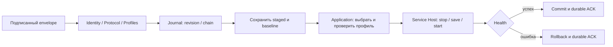

# Карта кода управляемой конфигурации

Актуализировано24.09.2026. Читать вместе с [STATUS](STATUS.md) и [планом](PLAN.md).
Это навигация по реализации, не заявление о rollout. Подробности последнего изменения:
[выбор Android gateway](releases/2026-09-24-android-gateway-selection.ru.md).

## От назначения до устройства

| Узел | Файл | Ответственность |
| --- | --- | --- |
| Реестр и выбор шлюза | [fleet.py](../control/fleet.py) | Lifecycle, endpoints, failure domains, оценка доступной ёмкости |
| Назначение/IP | [fleet_store.py](../control/fleet_store.py) | Авторитетные leases, поколение, ready/retiring, адрес нельзя переиспользовать до подтверждения удаления |
| Доступ | [fleet_access.py](../control/fleet_access.py) | Proof устройства и актуальный grant до резервирования |
| Применение на шлюзе | [fleet_worker.py](../control/fleet_worker.py), [fleet_gateway.py](../control/fleet_gateway.py) | Receipt/fencing, устойчивые повторы и согласование состояния |
| Подписание | [fleet_publish.py](../control/fleet_publish.py), [fleet.py](../provisioning/fleet.py) | Offline authority, pins, только ready lease, ciphertext для устройства |
| Общий wire contract | [configuration.py](../provisioning/configuration.py) | Schema2, подпись, шифрование, identity/endpoint binding и strict profile |
| Доставка | [relay.py](../provisioning/relay.py), [reticulum.py](../provisioning/reticulum.py) | Carrier; не наделён полномочиями подписывать конфигурации |

Fleet publication и relay ещё не соединены завершённой production цепочкой.
Verified ACK/offline→online перенос и миграция действующих прав/назначений остаются
открытыми. Код отдельных компонентов не доказывает готовность автоматического failover.

## Android: порядок чтения

Все Java-файлы ниже находятся в
`clients/android/app/src/main/java/com/familyconnect/app/`.

1. `ControlProtocol` проверяет подпись и расшифровывает envelope. `ControlProfiles`
   проверяет структуру, транспорт, gateway и параметры. Это ещё не разрешение apply:
   повтор/revision/цепочка обрабатываются дальше.
2. `ControlIdentity` хранит ключевой материал в памяти, предоставляет проверки/ACK,
   возвращает копию WG private key только для локальной подстановки. Копию нужно стереть.
3. `ControlJournal` перечитывает и проверяет сохранённые envelopes, floor, phase,
   staged/committed/baseline/outbox. `ControlJournalVault` хранит encrypted journal
   через Android Keystore/AtomicFile; отсутствие/повреждение не повод обнулить floor.
4. `ControlTransaction` сохраняет baseline и staged до side effects, вызывает apply,
   health и commit. При ошибке/незавершённой операции после restart вызывает rollback;
   ACK сохраняется в outbox до доставки. Успешная повторная доставка не повторяет apply.
5. `ControlApplication` материализует профиль: подставляет только локальный WG key,
   вызывает Host.validate до stop/save/start. Хранение — фиксированные слоты wg/awg/tcp.
6. `ConnectionService.application()` реализует Host: проверяет worker/operation owner,
   использует ProfileStore, ProfileValidator и parser engine, управляет stop/start/health.
   `ControlOperations`, `ControlMutationGate` и startup/recovery препятствуют обходу
   незавершённой транзакции через ручной импорт/обычный connect.

## Capability и выбор gateway

AWG3.1 разрешается только явным trusted `supportsAwg31`, переданным через
ControlJournal → ControlIdentity → ControlProtocol. Default false во всех overloads;
полученный JSON, версия или сохранённая запись не могут включить способность.
Production callers service/UI/enrollment пока используют default false. Их включение
должно быть согласованным: иначе одна часть прочитает journal, другая отвергнет его.

При apply/resume выбор gateway считывается один раз. Если ID задан, materialize берёт
только его профили; каждый slot может иметь один профиль. Неизвестный ID отклоняется
до stop. Пустой ID сохраняет прежнее поведение — подготовить все слоты и выбрать первый;
два профиля одного slot в этом режиме считаются неоднозначностью и отвергаются.

Resume не переписывает профили: он сравнивает локальные bytes с подписанным вариантом.
Поэтому переключить два gateway одного транспорта простым resume нельзя, если второй
ещё не установлен. Для этого добавлен `ControlTransaction.selectGateway(id)`:
проверка committed envelope → snapshot → durable SWITCHING → apply/health → сохранить
selected_gateway. При сбое recover восстанавливает baseline. Операция сохраняет
revision/floor/digest/ACK; повторная доставка envelope по-прежнему не вызывает apply.
Resume использует persisted selected_gateway. MainActivity отправляет `select-gateway`
в ConnectionService; существующий worker вызывает ControlSelection: enrollment admission,
recover, select и при необходимости verified resume. UI не записывает желаемый ID
заранее: preferences — кэш journal selection, перечитываемый на onResume/открытии выбора.
[Service/UI checkpoint и границы проверки](releases/2026-09-24-android-selection-service.ru.md).
Это исходники/компиляция; instrumented device acceptance ещё не выполнена.

Первый явный выбор переводит локальный journal schema1→2, добавляя selected_gateway
и pending_gateway. Нельзя откатить приложение к reader schema1 после такой операции;
обнуление journal/floor не является процедурой отката.
[Контракт, crash recovery и тесты](releases/2026-09-24-android-gateway-transaction.ru.md).

## Identity и границы незавершённой интеграции

Текущая managed-служба загружает ControlIdentityVault. Friends имеет отдельное
хранилище identity. Нельзя автоматически создать новый ключ вместо действующего,
подставить чужой journal или объявить Friends интеграцию выполненной после включения
одного bool. Нужны явная привязка существующей Friends identity, отдельный namespace
журнала и прежняя сериализация VPN operations.

Python/Linux аналог транзакционного слоя: `provisioning/transaction.py` и
`application.py`; runner `runtime.py` пока не включает AWG3.1 capability.
C# `clients/windows/Core/ControlProtocol.cs` и `ControlProfiles.cs` проверены на общем
corpus; Windows managed journal/broker integration и OS acceptance ещё не завершены.

## Проверки и отладка

Android `ControlSelectionRuntimeTest` — instrumented test реального
Keystore/ControlJournalVault: selection, повторное открытие объектов, resume/rollback
при имитированном Host. Guard требует точный debug package `.pilot`, пустые managed
хранилища/profiles и `fc_disposable=true`. Тест прошёл на Redmi Note 9 Pro/API31.
[Отчёт](releases/2026-09-24-android-selection-device.ru.md). Это не проверка process restart, service/UI или native VPN.
[Команда запуска и сборка с Python3.10](releases/2026-09-24-android-selection-runtime-preparation.ru.md).

- Общие signed bytes: `tests/vectors/control-awg31-v1`, legacy: `control-v1`.
  Не перегенерировать существующие bytes для сокрытия изменения семантики.
- Java: `ControlAwg31Test` — подпись/capability, journal, локальная materialization;
  `ControlSelectionAdmissionTest` — enrollment/recovery/selection/reconnect policy;
  `ControlSelectionTest` — signed multi-gateway fixtures, local selection/restart/expiry;
  `ControlApplicationTest` — выбор, отмена, ошибки save/stop, rollback;
  `ControlTransactionTest` — durable ordering, replay и crash points.
- Unit Host/storage — имитация, они не подтверждают Android Keystore, маршрутизацию
  Reticulum вне VPN, handshake, реальный полезный трафик или OEM/Doze.
- При разборе сбоя сначала определить границу: verify → journal → apply → health → ACK.
  Отсутствующий ACK не означает неработающий VPN, успешная подпись не означает commit.
  Не печатать plaintext-профили, приватные ключи и данные пользователей в диагностику.

Перед изменением поведения обновлять эту карту, тест соответствующего инварианта,
STATUS/PLAN и датированный отчёт с границами проверки. Публикация на GitHub отдельно
подтверждается коммитом/проверкой remote; локальная запись не считается опубликованной.

`ControlServiceAdmissionRuntimeTest` — три подготовленных проверки реальной Android-службы:
invalid gateway, отсутствие enrollment/повтор, отмена permission callback в MainActivity.
Только пустой debug `.pilot` с `fc_disposable=true`; проверяет отсутствие новых
managed secrets/profiles и освобождение owner/завершение службы. Сборка прошла,
выполнение на устройстве пока не подтверждено; системный VPN dialog и туннель не проверяются.
[Состояние и запуск](releases/2026-09-24-android-service-admission.ru.md).
