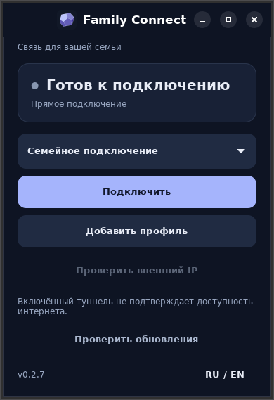

# Family Connect 0.2.7 — native Linux UI

The Linux frontend now uses GTK 4/libadwaita instead of Tk. GTK's retained rendering
replaces independently repainted Tk/X11 child windows. Compact header, status card,
native dropdown/confirmation/file picker, one-column actions and content-sized height.
Unchanged state does not update widget properties. Initial profiles and VPN status are
published together. The backend, keys, NetworkManager profiles and update trust anchor
are preserved. Windows remains the native Windows application.

Prerequisites for Linux: Python GI, GTK >=4.8, libadwaita >=1.2, cryptography, NetworkManager.
Ubuntu/Debian: `sudo apt install python3-gi gir1.2-gtk-4.0 gir1.2-adw-1 python3-cryptography`.
These libraries were already present on the user's laptop; no system packages changed.
The six-file archive remains compatible with existing updaters. On another Linux host,
install prerequisites before upgrading: smoke failure preserves the old installation.
No runtime package installation or privilege escalation is hidden in the updater.

Local checks: 27 desktop tests; 24 GTK layouts at 100–250%, model/update/selection/stale
reply/slow-poll/confirmation checks on GTK 4.8/libadwaita 1.2. Real laptop GTK 4.22,
libadwaita 1.9 on native Wayland: 390×548 logical pixels. Two initial state renders over
8 seconds, no periodic property updates. Final warm sample max/p95 callback gap 16.2 ms
at a 16 ms target; 0.154 CPU seconds. Earlier Tk sample included a 1.4 s gap outside
Python handlers. This is an observed comparison, not proof that every system will have
identical performance; user visual confirmation remains required.

Rendering model: https://docs.gtk.org/gtk4/drawing-model.html
Current rollout and next work: [STATUS](../STATUS.md), [PLAN](../PLAN.md).

## Verified rollout / Выпуск

Source `68b6ffb`; client CI [34519568050](https://github.com/Joker20380/family_connect/actions/runs/34519568050)
and phase0 [34519567996](https://github.com/Joker20380/family_connect/actions/runs/34519567996)
succeeded. Immutable GitHub assets downloaded and SHA256SUMS verified before offline
catalog signing (sequence 6). Linux installed using the 0.2.6 updater; startup smoke
passed, previous 0.2.6 retained. Windows installer published; personal installation
not confirmed. Server remains 0.2.1. Reopen Linux app for the new UI.

