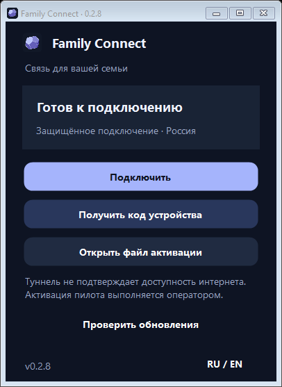

# Family Connect 0.2.8 — Windows в стиле Linux 0.2.7

Пользователь подтвердил внешний вид и поведение Linux 0.2.7. Windows приведён к той
же композиции: компактный заголовок со значком, скруглённая карточка состояния,
кнопки в одну колонку и высота окна по содержимому. Уменьшены шрифты и отступы,
вспомогательные действия оформлены спокойнее. Подтверждения обновления и закрытия,
а также окно кода устройства используют общую палитру. Главная системная шапка тёмная
на поддерживаемых версиях Windows. Получение кода и загрузка активации сохранены.

Проверки: компиляция .NET без ошибок; Windows CI — 96 вариантов разметки при масштабе
100–250%, RU/EN и четырёх состояниях подключения; отсутствие обрезки карточки,
неизменившийся опрос, устаревшие ответы и отмена подтверждения. Установка, служба,
драйвер и запуск интерфейса прошли CI. Linux-тесты и phase0 также прошли.

Исходный коммит `5f0303d`. [Сборки клиентов](https://github.com/Joker20380/family_connect/actions/runs/34522112485).
Файлы неизменяемого выпуска скачаны и сверены с SHA256SUMS до подписи каталога
с порядковым номером 7. Установщик Windows доступен; установка на личный ПК ещё не
подтверждена. Можно использовать «Проверить обновления» либо скачать установщик.
На ноутбуке оставлен одобренный Linux 0.2.7; в Linux 0.2.8 изменён только номер версии.
Сервер остаётся на 0.2.1. [Текущее состояние](../STATUS.md), [план](../PLAN.md).

## Дополнительная серверная проверка — 10.09.2026

На сервере 0.2.1 выполнен [полный продуктовый цикл](../live-product-smoke.ru.md):
регистрация тестового устройства, установка peer штатным worker, выдача и проверка
provisioning, отзыв и удаление peer. Три существующих peer сохранены. Клиентские
артефакты и каталог 0.2.8 не менялись. Применение runtime/ACK — следующий этап.
Точные backup/cleanup и ограничения проверки приведены в отчёте.
