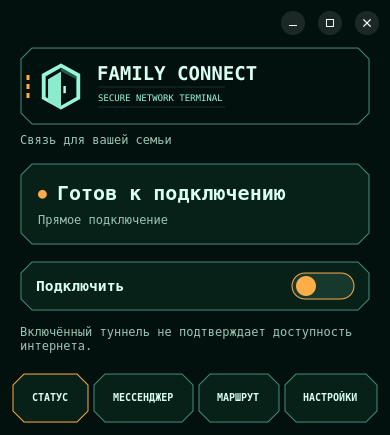

# Desktop terminal — 2026-09-20

Ветка `desktop/friends-access-20260919`: `aaa6c40` — общий стиль и вкладки,
`4aba2d9` — проверка установки TCP из настроек, `6ed47bc` — проверка видимых
Windows settings и границ нижней навигации. Нового релиза нет.
Android остаётся **0.1.18-beta19/code19**, публичный desktop — **v0.2.9**.
Версия v0.2.9 на тестовых снимках — существующая source version, не новая поставка.

Перенесены палитра Android, логотип, шапка с двумя короткими линиями, срезанные
рамки и короткий переключатель с оранжевым/мятным состоянием. Постоянные разделы:
Статус / Мессенджер / Маршрут / Настройки. Версия и служебные действия в настройках.
В обеих локалях названия переключаются вместе с языком.
[Правила оформления](../design/desktop-terminal.ru.md).

## Проверки

- Windows app cross-build .NET10:0 errors,0 warnings; это не runtime acceptance.
- Linux GTK/D-Bus/Xvfb:24 layout cases (RU/EN,100–250%) и state/poll/confirmation
  regressions passed. Проверяются видимость всех вкладок и скрытие неактивной страницы.
- GTK TCP installer: missing bootstrap, confirmation/cancel, successful completion,
  authorization cancellation, connected/busy guards passed; broker mocked.
- GTK Friends: activation/referral/configuration completion passed; HTTP mocked.
- `git diff --check` passed; documentation checker:221 links/17 entry files,0 errors.
- CI35473759652: Linux failed на старом TCP layout check (исправлен4aba2d9),
  Windows отменён GitHub concurrency при запуске нового commit, Android SDK setup failed.
- CI35473867188: Linux success; Windows install/broker/UI прошли, layout failed
  на устаревшей проверке скрытого language control (`Clipped footer`). Исправлено
  в6ed47bc: проверяется только видимый элемент настроек, добавлены границы всех
  кнопок нижней навигации. Android setup-android failed, release skipped.
- [Client builds35474122321](https://github.com/Joker20380/family_connect/actions/runs/35474122321)
  на6ed47bc завершён: Linux success; Windows build, install, broker и UI passed,
  финальный layout failed с `Clipped or overlapping content` (MainForm.cs:183).
  Android setup-android failed, release skipped. Успешной поставкой этот run не является.
- Native Windows TCP35474122315 и AWG35474122305 ещё выполнялись при последней
  проверке: соответственно LocalSystem routes/DNS/cancellation/crash recovery и
  signed AWG activation/data cleanup. Их успех пока не подтверждён.
- Полный Windows PNG ещё не просмотрен: public check annotation обрезает base64
  до4096 символов. Не считать повреждённую копию визуальной проверкой.

## Реальные снимки GTK в тестовом состоянии

Это рендер приложения в Xvfb с тестовым выключенным подключением, не проверка VPN.
Реальные ключи, адреса устройств и приглашения не использовались.

[Маршрут](../assets/desktop-terminal/linux-route.png) ·
[Настройки](../assets/desktop-terminal/linux-settings.png) ·
[Мессенджер в разработке](../assets/desktop-terminal/linux-messenger.png)

## Что остаётся

Windows render/runtime gate, дальнейшее выравнивание содержимого экранов и окон
приглашений, desktop messenger, QR и карта маршрута. Linux Friends VPN apply/recovery,
AWG3.1 native compatibility и /16, живые проверки Linux/Windows, in-place update.
Наличие вкладки мессенджера не означает реализованную desktop-переписку.

## Rollout / rollback

APK, desktop installers, gateways и signed catalogs не менялись. Код опубликован
только в desktop-ветке; public main остаётся d87f30d. Standalone Linux архив по-прежнему
имеет шесть файлов; новый рисующий код находится внутри app.py.
Не публиковать изменённые бинарники под существующим v0.2.9. Следующий релиз —
новая версия, после platform CI, проверки скачанных assets и offline signing.
Откат исходников — revert aaa6c40/4aba2d9/6ed47bc в desktop-ветке; пользовательского отката
сейчас не требуется. Сохранённые identity/профили и marker не удалять.

## Остановка на ночь

По просьбе пользователя работа остановлена после ожидания Client builds и записи
результата. Изменения runtime в этой сессии не вносились. Следующая сессия начинается
с определения элемента/вкладки/масштаба, на котором Windows layout сообщает
`Clipped or overlapping content`; сейчас диагностическое сообщение этих данных
не содержит. Добавить контекст ошибки, исправить геометрию и повторить Windows CI,
сохранив проверки границ и наложений. Затем просмотреть полный Windows screenshot
и получить подтверждение на реальном компьютере. Проверить оставшиеся native runs.

Проверка ссылок отчёта и `git diff --check` пройдены. Rollout/rollback и публичные
версии остаются указанными выше; установленный Android beta19 не менялся.
