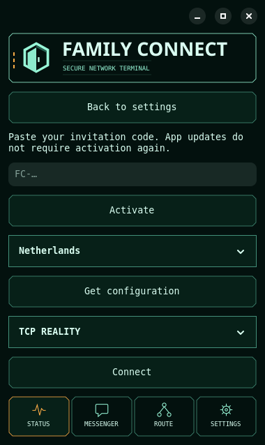

# Linux: выход из приглашений и общая навигация — 20.09.2026

Пользователь обнаружил окно без доступного возврата после открытия приглашений.
Причина: отдельное модальное Adw.Window не имело HeaderBar/кнопки выхода,
при этом главное окно блокировалось. Первое исправление f9af189 добавило шапку;
пользователь попросил общий интерфейс. Финальное решение d93611e встраивает
Friends внутрь основной области: общая шапка, четыре нижние вкладки, кнопки
TerminalButton. Переключение вкладки возвращает основной экран; Esc — настройки.
Закрытие во время операции ожидает её завершения с явным сообщением, затем
восстанавливает состояние главного экрана. Закрытие приложения сначала обновляет
состояние VPN и использует штатное подтверждение при активном соединении.

Установлен paired Linux 0.2.9 preview bundle:
`11c53d18c3bc10a9bd129a55c466b93f5cb7e91b0d5ff8d90b850db7c004b932`.
Архив SHA256 `f0f877cb7a6933a950d3c53c100da41f231963912c9cfbc5ebee2ee326cbd037`,
114644 байта. Исходник d93611e. Оба ярлыка переключены; systemd user unit
family-connect-embedded-20260920 запущен. Shared venv 5a9ca444046993a7 сохранён;
lockfile совпал, manifest verify passed. До перезапуска VPN не активен,
Friends application phase IDLE, fcawg/fctcp отсутствовали. Данные/ключи не удалялись.

Проверки: GTK activation/referral/configuration/transport/QR, возврат, Escape,
повторное закрытие, отложенное закрытие, переход нижними вкладками, закрытие всего
приложения после обновления состояния; без сетевых мутаций. 24 основных GTK layout
cases passed. Рендер просмотрен. Linux control CI35503217768, job106058546158 success:
полный Python suite, layouts/recovery, упаковка и extracted Friends GUI.
Windows исходники этим исправлением не менялись.

Rollout: отдельный immutable bundle под ~/.local/share/family-connect/control-previews/11c53d18c3bc10a9.
Rollback: после штатного завершения операции закрыть GUI и восстановить оба .desktop
из state-client-build/linux-embedded-20260920/*.previous (промежуточный4a2a7f7614e1bd4c).
Исходный cce586a74c391108 доступен через backup linux-navigation-20260920.
Не восстанавливать старую модальную версию как постоянное решение дефекта.
Все архивы/окружения сохранены. Runtime receipt: state-client-build/linux-embedded-20260920/installed.json.
Остаётся пользовательская оценка финального встроенного экрана; художественная
анимация отдельно. Публичное распространение фиксируется отдельным отчётом загрузок.
