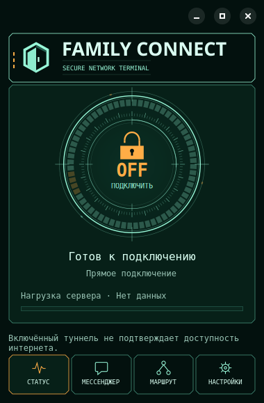

# Шкала нагрузки сервера на Linux — 20.09.2026

Вместо дублирующего блока подключения под кругом установлен тонкий индикатор
нагрузки. Сам круг сохраняет штатное подключение/отключение. Пользователь выбрал
общую нагрузку (CPU и канал), но лимиты тарифов обоих VPS неизвестны.
Поэтому общий процент сейчас недоступен, не заменяется CPU и не отображается как 0%.
При наведении доступны реальные CPU и RX/TX выбранного известного gateway.

## Установленная версия и проверки

Linux APP_VERSION0.2.9 preview, source b4ef324, bundle
`c55149740c24618ce94c9220b2a7e203b714a1e04462f9f39a460bac3e29a75b`.
Archive SHA256 `f3e3836df869165cd9e929687a3dc9faca5d3e773c38ff4c3c94c7f9f79fe2ae`.
Установлен в ~/.local/share/family-connect/control-previews/c55149740c24618c,
оба ярлыка обновлены; unit family-connect-load-20260920 active. Manifest verify и
совпадение requirements lockfile с существующим venv5a9ca444046993a7 проверены.
Перед перезапуском GUI: VPN отсутствовал, application journal IDLE.
Ключи, активация, VPN helpers сохранены.

12 targeted tests passed (сборщик + клиентская валидация), 24 GTK layout cases passed.
Native Cairo checks: карта, круг, процент/неизвестная ёмкость/устаревшие данные/
смена сервера/отсутствие дублирующей кнопки passed. Рендер просмотрен.
Linux control CI35504074694/job106060785918 completed success: Python suite,
рендер/взаимодействие, packaging и extracted GUI. Общий Client builds не объявляется зелёным.
Реальные установленные профили сопоставлены с RU/NL, свежие метрики прочитаны через
HTTPS без подключения VPN; оба load_percent=null при неизвестных лимитах.

## Мониторинг

На двух разрешённых gateway запущен только новый
family-connect-server-load.service, непривилегированный пользователь fc-load.
Код/настройки: /opt/apps/family_connect/server-load/{monitor.py,config.json}.
CPU считывается из /proc/stat, RX/TX — из counters внешнего интерфейса, интервал15s.
Это занятость ресурсов всего VPS, включая конкурирующую нагрузку, а не статистика
только одного VPN-процесса. История посещений и идентификаторы устройств не собираются.
Другие сервисы, в том числе соседние проекты, не изменялись.

RU читает NL по отдельному SSH-ключу: from=185.251.89.19, restrict,
forced command только cat /opt/apps/family_connect/server-load/snapshot/snapshot.json.
Приватный ключ только на RU в server-load/state/read-nl; в Git/CI его нет.
Использованы уже закреплённые host keys. VPN/регистрация используют прежние ключи.
RU публикует агрегаты через существующий TLS:
https://185.251.89.19:8443/status/server-load.json . Cache-Control:no-store.
Клиент привязывает метрики к endpoint выбранного профиля; неизвестный endpoint,
ошибка/данные старше45s или из будущего более15s — недоступность, не нулевая нагрузка.
Сеть мониторинга отделена от очереди VPN-проверок. После смены профиля старый ответ
не применяется к новому серверу. Отказ телеметрии не меняет VPN-соединение.

Первый запуск RU не мог записать snapshot из-за приватного HTTPS parent0700.
Исправлено systemd BindPaths только для каталога публичных метрик; parent остался0700.
Повторная проверка: ActiveState=active, NRestarts=0, RU/NL присутствуют в свежем JSON.
HUP выполнен только для family-connect-product-https после nginx -t с явным
/etc/fc/nginx.conf. VPN-сервисы не перезапускались.

## Семантика и незавершённое

При подтверждённом capacity_mbps индекс = max(CPU%, 100×max(RX,TX)/capacity),
ограниченный100. Для полного дуплекса направления не суммируются, иначе VPN-трафик
считается дважды. Это индекс занятости CPU/канала, не гарантия скорости или доступности.
Пороги цвета70/90 — визуальные ориентиры, не измеренная граница отказа.
Оператор задаёт положительное число capacity_mbps в config.json каждого VPS после
проверки тарифа/ёмкости; монитор перечитывает его каждые15s. Сейчас обе величины null.
Не использовать скорость виртуальной NIC как подтверждённый лимит провайдера.
Нагрузочные испытания не запускались. Определение ёмкости остаётся открытым.

Изменение UI установлено только на Linux; Android beta25 и Windows21b740a прежние.
Публичная страница скачивания пока содержит Linux11c53d18c3bc10a9 без шкалы нагрузки;
новый c55149740c24618c не опубликован, подписанные update catalogs прежние.
Остаются: пользовательская оценка, подтверждение лимитов, перенос шкалы на другие
клиенты при продолжении общего UI, отдельный неизменяемый download для этой сборки.

## Откат

GUI: штатно завершить операции, закрыть новый GUI; восстановить оба .desktop из
state-client-build/linux-load-20260920/*.previous и запуск11c53d18c3bc10a9.
Старые bundles и данные сохранены; не удалять незавершённый journal.

Мониторинг: systemctl disable --now family-connect-server-load.service на каждом
из двух разрешённых gateway. Не останавливать VPN. Удалить только строку нового
ключа с комментарием fc-server-load-readonly из NL authorized_keys после сравнения.
Не менять существующие registration/operator keys.
Nginx backup: state-product-https/config/nginx{,-final}.conf.before-server-load-20260920;
сначала учесть последующие изменения, nginx -t -c /etc/fc/nginx.conf, затем HUP
только family-connect-product-https. Можно вместо полного отката удалить только
exact location /status/server-load.json. Снимки быстро истекают на клиентах.
