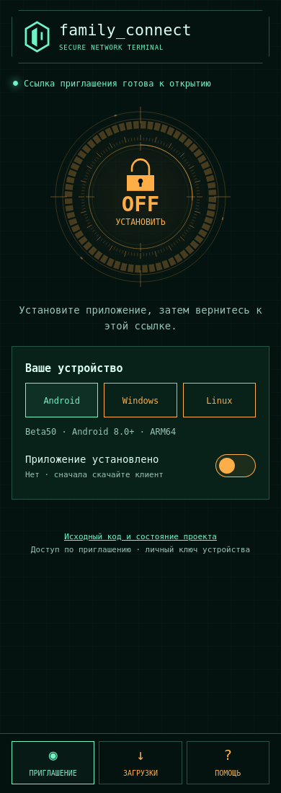

# Единые переключатели и интерактивное приглашение — beta50

23.09.2026 пользователь уточнил: страница должна быть интерактивной в стиле приложения;
переключатели на странице и во всех клиентах — оранжевые OFF и бирюзовые ON.
Выпущены Android0.1.18-beta50/code50 и desktop0.2.10 manual preview.
Страница, updater и загрузки согласованы. Ранее распространялись49/35/desktop0.2.9; прежние файлы сохранены.

## Изменения

Единая палитра состояний: OFF#ffad46, ON#70f4c6. Кольца, деления, подпись и символ
круга подключения используют его состояние во всех трёх клиентах. Ожидание остаётся
оранжевым; отключённые элементы приглушаются, не меняя смысл цвета.
Android: капсульные переключатели, фоновая доставка, Auto технического клиента и
подтверждение доверия контакту используют те же цвета. Навигация не является VPN-state.

Страница: вкладки приглашения/загрузок/помощи, выбор платформы, круг установки/открытия,
переключатели установленного приложения и анимации. Ссылка сохраняется между вкладками,
не записывается в storage и не расходует claim в браузере. Страница не включает VPN;
настоящее подключение по-прежнему выполняется в клиенте. Учитывается reduced motion.

## Проверки и выпуск

Локально beta50:153 unit tests, lint, ARM64 build и instrumentation compile passed.
D8 merge потребовал увеличения Gradle heap с1536MiB до3072MiB; итоговая сборка прошла.
Firefox:4 сценария ×13 проверок (валидная ссылка ON/OFF, без ссылки, неверная ссылка),
включая цвета, вкладки, платформы, сохранение fragment и запрет открытия неверного URI.
OFF/ON renders просмотрены. Скрипт: scripts/check_invitation_page.py.
Локальная GTK/Wayland матрица нестабильна по геометрии/фокусу; baseline также потерял
фокус. Геометрия приложения не изменялась, полная матрица прошла в Xvfb CI. Native UI/URI acceptance и публикация завершены, см. итог ниже.
Первый CI baece0d проверил Windows installed URI handler, ordinary-user, AWG/TCP и Linux.
Android остановился до Friends URI check: не обнаружен системный диалог VPN revoke;
последующие ошибки были при очистке оставшегося VPN. Harness теперь запускает тестовый
Activity из shell и ищет реальный системный диалог во всех доступных окнах accessibility.
Это не изменение разрешений VPN в приложении и не пропуск проверки revoke.

По результатам приёмки опубликованы beta50 с прежним подписантом, desktop0.2.10,
единая страница и документация. Page/nginx/discovery сохранены перед rollout. Откат метаданных
не удаляет приложения, идентичности или immutable файлы; Android code50 не заменяет49.

## Итог публикации

Исходный код клиентов:840181d011f6f13fd40543f0280e66c65c2b1e06.
Android50 установлен поверх49; данные не очищались. APK certificate SHA256:
`67a90d1bfcd5a2c0666f0cff1b0ac5e43aaa661ca1196f89e879aa39fe20848a`. Публичный APK совпал с локальным подписанным файлом.

CI: Client builds35906041234; Linux control35906041187; Windows AWG35906041181;
Windows TCP35906041363; ordinary-user35906041231; phase035906041335 — success.
Полные Windows PNG скачаны из проверенного artifact и просмотрены.

Публичные файлы:

- `FamilyConnect-Control-Linux-preview-8e9fabe3cbef2989.tar.gz` — 120093 bytes, SHA256 `67b569cb2423692f088baa7ef0d83761394bec4fadb38249ac0788a046605795`.
- `FamilyConnect-Linux-0.2.10-invitation.txt` — 3371 bytes, SHA256 `2d1e0578767c3e0258f9214c080363cbc54c04944cea91e6b5f704393ba8c5bd`.
- `FamilyConnect-Setup-0.2.10-preview-840181d.exe` — 49931275 bytes, SHA256 `accd67ba613a58445bc9303bfd4a18946a2a59dc387a5730fb83234e37c7a5fe`.
- `FamilyConnect-Test-0.1.18-beta50.apk` — 36448332 bytes, SHA256 `8a1d44eac8cdd45bb9225e930c71377ea5b38428238300803fecc42a60761369`.

Откат страницы/nginx/discovery: `/opt/apps/family_connect/state-product-https/config/rollbacks/desktop0210-20260923-840181d/`. Вернуть сохранённые четыре файла, выполнить nginx -t и HUP только family-connect-product-https. Новые загрузки оставить неизменными. APK50 не заменять49 на устройстве; исправления выпускать с большим code. VPN/backend/DB при rollout не менялись.

Остаются физический Windows-ПК, российская сеть, длительный фон и точная задержка Doze. Предыдущие подтверждения двух телефонов не выдаются за повторную приёмку beta50.

## Приёмка пользователем и уточнение круга

Пользователь подтвердил цвета beta50 на Redmi. По замечанию о несовпадении круга
страницы упрощённое пунктирное кольцо заменено геометрией native dial:64 сегмента,
120 делений,4 окружности, координатные риски, дуги и замок. OFF оранжевый, ON бирюзовый.
Круг открывает загрузку/приложение; состояние ON здесь означает готовность открыть
приложение, а не факт VPN-соединения. Анимация учитывает reduced motion и переключатель.
Firefox:4 сценария×13 проверок для исходной страницы на320/390/1280px; после замены
круга повторные4×13 на каждой из тех же трёх ширин; OFF/ON рендеры просмотрены. Нативная геометрия масштабируется SVG.

Точечный откат последней правки страницы: сохранить текущие файлы, восстановить
nginx.conf, nginx-final.conf и invite.html из
`/opt/apps/family_connect/state-product-https/config/rollbacks/invite-native-dial-20260923`,
проверить nginx -t и послать HUP только family-connect-product-https.
APK/discovery и desktop-файлы эта последняя правка не меняла.

Проверенный SHA256 итоговой страницы: `6c8a6f7f8023b56aa5af680814497218c215e589c3604d64308766caf47d71b0`.
GitHub publisher35907665572 — success; публичные GitHub и HTTPS файлы скачаны и сверены.
